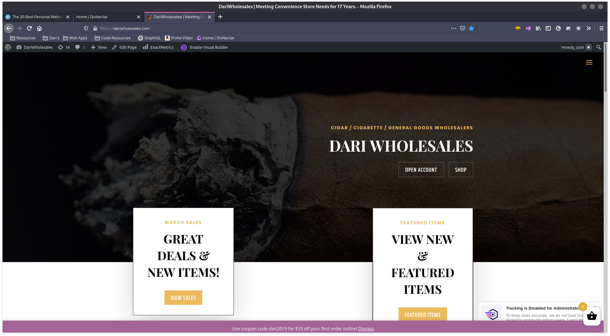
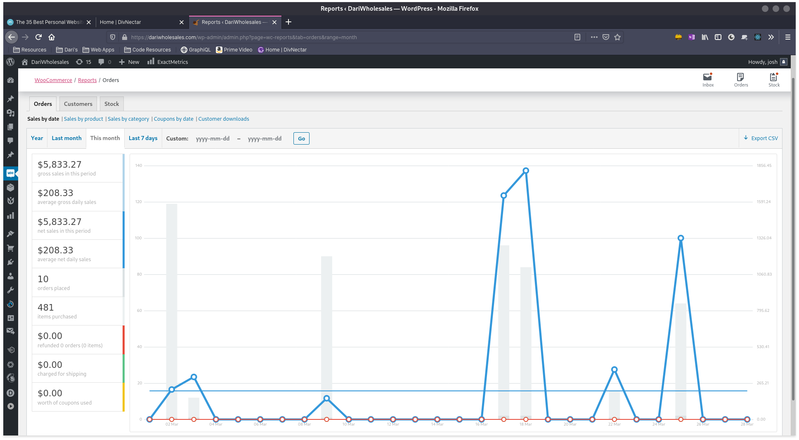
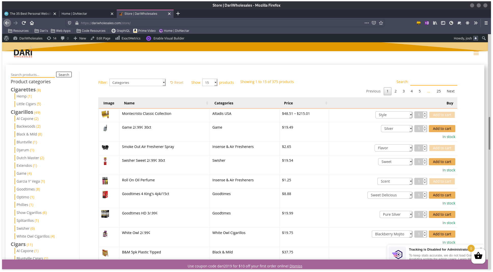

# Dari Wholesales

#### Online Wholesale Store

This website was entirely built by me, using wordpress. I utilized the Divi Premium Wordpress theme in order to meet the time requirements of the company. A rival wholesale company had reccently opened a wholesale site of thier own.

This is a site that I still currently maintain, that has actual sales on a weekly basis.

The site is home to over 200 different items, each with up to 20 variations. I have written a custom script in c# that my on-site server I created runs. It syncronizes the on-site POS inventory quantity and price values of all items on the site that have a matching SKU number, reducing matenience time by days out of the year.

on top of those things, the site also has a mailing list that goes along with it that alerts customers of pending sales and flash sales, and sends them the monthly sales page that I also design every month.
