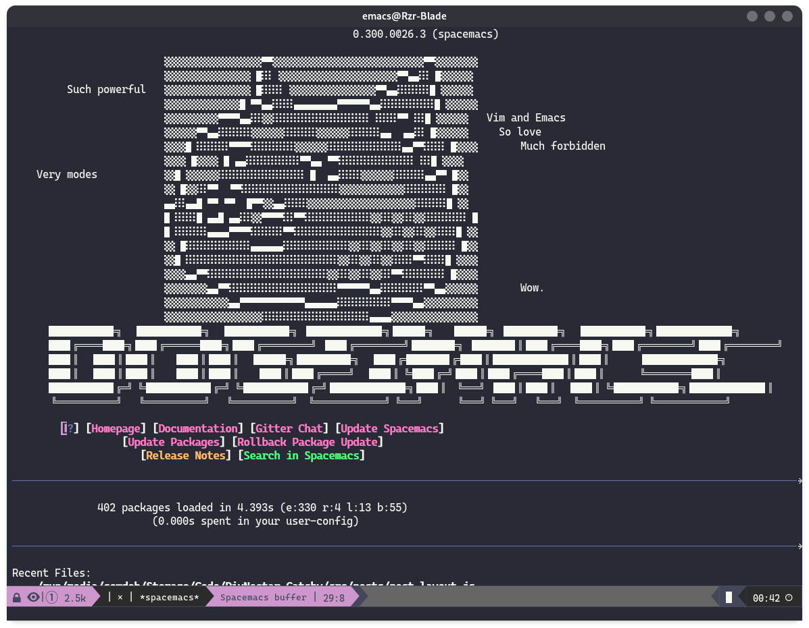

# Installing Spacemacs

## Why use Spacemacs? 🤔

Spacemacs is a build of Emacs, a popular GNU text editor. Emacs is known for being a very powerful editor, but having a less than ergonomic set of shortcuts. On the other side of the spectrum, we have Vim, which has a very nice set of pnumonic shortcuts that are easy to access and easy to remeber, while also remaining easy on the fingers and wrists. Spacemacs comes in and combines the best of both worlds, and allows you the power and extensibility of Emacs with the friendly shortcuts and editing power of Vim. Spacemacs uses the space key to replace the standard Vim leader key, and pops up a pnumonic menu for additional shortcuts. It really is a superb editor.

However, there is a steep learning curve for spacemacs, but nothing that we can't handle over the course of a couple tutorials. With that said, let's get into it!

## Installation:

For the installation, we have to begin by installing emacs for your OS

#### Linux

###### Arch Systems:

```zsh
    sudo pacman -S emacs
```

###### Debian Systems:

```zsh
    sudo apt install emacs
```

#### Mac OS

```bash
    brew install emacs
```

#### Windows

For windows, things are (as always) a bit more involved. You'll need to head over to [Chocolatey's](https://chocolatey.org/) website and follow the install instructions for the package manager. After that's installed, open up a admin powershell terminal and enter the following:

```powershell
    choco install emacs
```

## Installing Spacemacs ontop of Emacs

The simplicity of the next step depends highly on your system. If you running a \*nix system (Ubuntu, Debian, Arch, Mint, POP!, OSX, etc.) the installation is easy as:

```shell
    git clone https://github.com/syl20bnr/spacemacs ~/.emacs.d
```

If you're running windows, sadly, things are again more complicated for you. Better the pay off though! Don't be discouraged. Windows package manage we insalled earlier simply puts the emacs directory somewhere the spacemacs install script doesn't know about. So we will just install it manually.

//TODO:
[coming soon! haven't been on my windows install in a while....]

## All Done🎉🎉

You now have spacemacs installed! Congrats!


